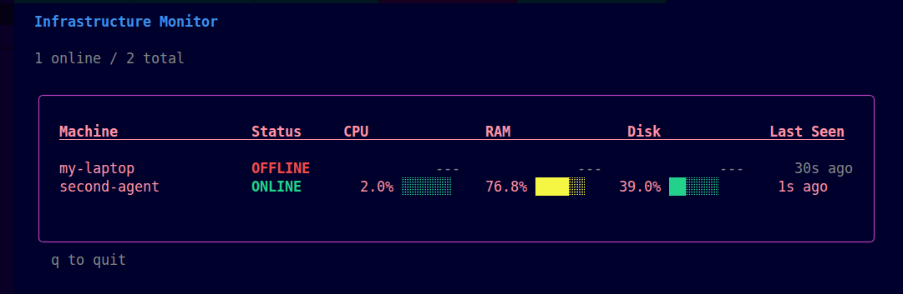

# Infra Monitor



Infra Monitor is a Go-based infrastructure monitoring system that collects machine metrics from distributed agents and displays them in a real-time terminal dashboard.

The project is organized as three independent services:

* **Agent** – Collects system metrics from monitored machines.
* **Server** – Receives metrics, maintains the latest state, and broadcasts updates.
* **Dashboard** – Displays live infrastructure status in a terminal interface.

Metrics are transmitted over WebSockets and stored in memory for real-time monitoring.

---

## Features

* Real-time CPU, memory, and disk usage monitoring
* Multiple agent support
* Live terminal dashboard
* WebSocket-based communication
* Automatic agent reconnection
* Offline agent detection
* Graceful shutdown
* Environment-based configuration
* Structured logging using `log/slog`
* Docker and Docker Compose support

---

## Architecture

```text
                    WebSocket                     WebSocket
+-----------+      Metrics      +-----------+     Updates      +--------------+
|   Agent   | ─────────────────▶|  Server   |─────────────────▶|  Dashboard   |
+-----------+                   +-----------+                  +--------------+
      │                                │
      │                                │
      └────── Collects system metrics ─┘
```

The server receives metrics from connected agents, stores the latest state for each machine, and broadcasts updates to connected dashboards.

---

## Technology

| Responsibility          | Technology             |
| ----------------------- | ---------------------- |
| HTTP Server             | Gin                    |
| WebSocket Communication | Gorilla WebSocket      |
| System Metrics          | gopsutil               |
| Terminal Dashboard      | Bubble Tea + Lip Gloss |
| Logging                 | `log/slog`             |
| Containerization        | Docker, Docker Compose |

---

## Repository Structure

```text
infra-monitor/
├── agent/
├── dashboard/
├── server/
├── shared/
├── assets/
├── compose.yaml
├── go.work
└── LICENSE
```

| Directory    | Purpose                                                            |
| ------------ | ------------------------------------------------------------------ |
| `agent/`     | Collects and publishes system metrics.                             |
| `server/`    | Receives metrics, tracks connected agents, and broadcasts updates. |
| `dashboard/` | Terminal UI for monitoring connected machines.                     |
| `shared/`    | Shared message types used across all services.                     |
| `assets/`    | Documentation assets such as screenshots.                          |

---

# Prerequisites

### Local Development

* Go 1.26 or later

### Containerized Development

* Docker
* Docker Compose

---

# Installation

Clone the repository.

```bash
git clone <repository-url>
cd infra-monitor
```

---

# Running with Docker (Recommended)

> [!NOTE]
> Before running with Docker Compose, update the `SERVER_URL` value in:
>
> - `agent/.env`
> - `dashboard/.env`
>
> Replace `localhost` with the Compose service name:
>
> ```text
> ws://localhost:8080/ws/agent     → ws://server:8080/ws/agent
> ws://localhost:8080/ws/dashboard → ws://server:8080/ws/dashboard
> ```

Build and start the complete monitoring stack.

```bash
docker compose up --build
```

Stop all services.

```bash
docker compose down
```

---

# Running Locally

Start each service in a separate terminal.

### Server

```bash
cd server
go run .
```

### Dashboard

```bash
cd dashboard
go run .
```

### Agent

```bash
cd agent
go run .
```

Run additional agent instances with different `AGENT_ID` values to simulate multiple monitored machines.

---

# Configuration

Each service loads its configuration from environment variables.

### Server

| Variable   | Description                       |
| ---------- | --------------------------------- |
| `ADDR`     | HTTP and WebSocket listen address |
| `GIN_MODE` | Gin runtime mode                  |

### Agent

| Variable     | Description                                  |
| ------------ | -------------------------------------------- |
| `AGENT_ID`   | Unique identifier displayed in the dashboard |
| `SERVER_URL` | WebSocket endpoint for publishing metrics    |

### Dashboard

| Variable     | Description                                   |
| ------------ | --------------------------------------------- |
| `SERVER_URL` | WebSocket endpoint for receiving live updates |

Example configuration files are included:

```text
agent/.env.example
server/.env.example
dashboard/.env.example
```

Copy each example file to `.env` before running the corresponding service locally.

---

# Architecture Decisions

### Independent Services

The agent, server, and dashboard are separate executables with distinct responsibilities. This keeps each component focused and allows them to be developed and deployed independently.

### Shared Types

The `shared` module contains common data structures used by all services, ensuring a consistent communication contract without duplicating code.

### In-Memory State

The server stores only the latest metrics reported by connected agents. This keeps the implementation focused on real-time monitoring without introducing database persistence.

### Go Workspace

The repository uses a Go workspace (`go.work`) to develop multiple Go modules within a single repository while keeping them independently versioned.

---

# Limitations

Current project scope intentionally excludes:

* Persistent metric storage
* Historical metrics
* Authentication and authorization
* TLS-encrypted communication
* Alerting and notifications

All monitoring data exists only in memory and is lost when the server stops.

---

# Testing

Automated tests are not currently included.

The project has been manually verified by testing:

* Local execution
* Docker Compose deployment
* Multiple concurrent agents
* Real-time dashboard updates
* Offline agent detection
* Agent reconnection
* Graceful shutdown

---

# License

This project is licensed under the MIT License. See the `LICENSE` file for details.
